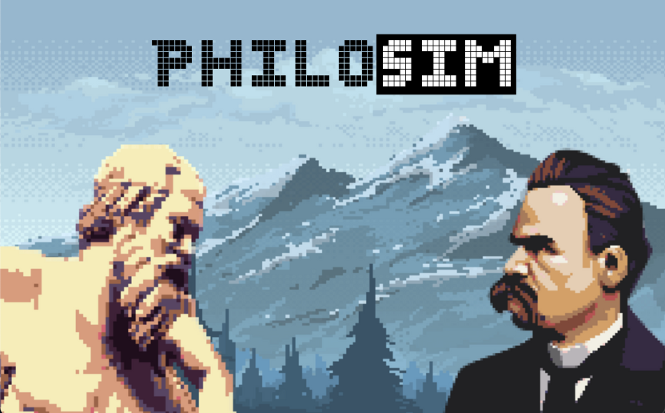

# PhiloSim


PhiloSim is an AI powered philosophical conversation generator. It uses OpenAI's GPT-3.5-TURBO to generate a conversation between Socrates and Friedrich Nietzsche about a particular topic. It then uses TikTok's text-to-speech functionality to give a voice to the generated script. The script is then played using PyGame. 

See [Preview](#Previews)

## Installing Dependencies

```
pip install -r requirements.txt
```

## Playing a script (RECOMMENDED)

This will simply choose an already generated script at random and play it.
Simply run `front-end.py`

```
python3 front-end.py
```

## Generating and playing a script (OPTIONAL)

If you want to generate a new script based on a specific topic, you need to run `philosim.py`. But for this you need to setup some environment variables first, see next section.

```
python3 philosim.py
```

### Setting up environment variables (OPTIONAL)

If you want to generate new scripts, you need to set your `OPENAI_API_KEY` and `TIKTOK_SESSION_ID` environment variables. The TikTok session id is needed for using TikTok's text to speech API, which is totally free. I used this [repo](https://github.com/oscie57/tiktok-voice) by [oscie57](https://github.com/oscie57) for this clever TikTok TTS trick. You also have the option to simply run an already generated script, this will not require you to set any environment variables.
To find your TikTok session ID, follow the steps:

1. Log into the [TikTok Web App](https://www.tiktok.com/)
2. Install the [Cookie Editor](https://cookie-editor.cgagnier.ca/) extension for your browser
3. Open the extension and look for `sessionid`
4. Copy it and paste it.

On Windows CMD:

```
set OPENAI_API_KEY = <your OpenAI API key>
set TIKTOK_SESSION_ID = <your TikTok session id>
```

On MacOS and Linux:

```
export OPENAI_API_KEY = <your OpenAI API key>
export TIKTOK_SESSION_ID = <your TikTok session id>
```
# Previews
## Loneliness
https://github.com/ilyasben26/PhiloSim/assets/73348981/74854b00-defb-4218-a61a-44b751b254c2

## Topic: Postmodernism
https://github.com/ilyasben26/PhiloSim/assets/73348981/5263cd9d-b506-492a-89d4-d91396bf1786


